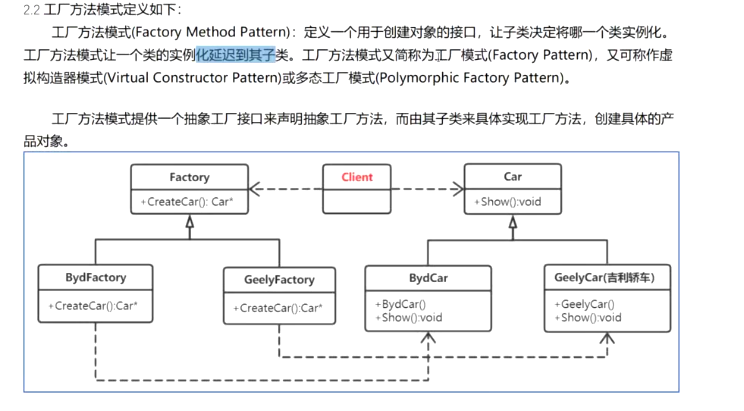
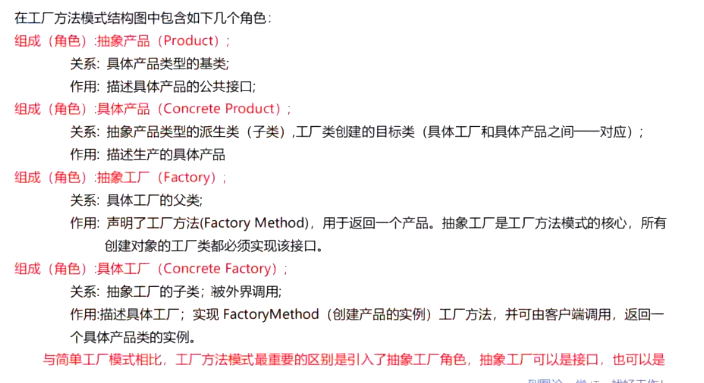
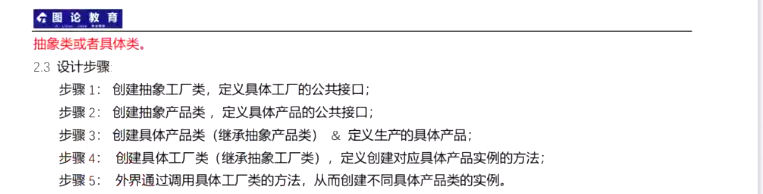
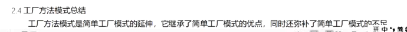
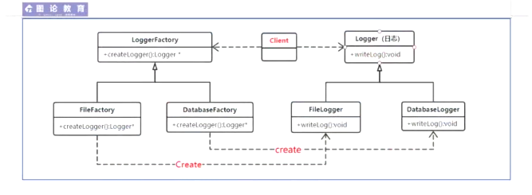
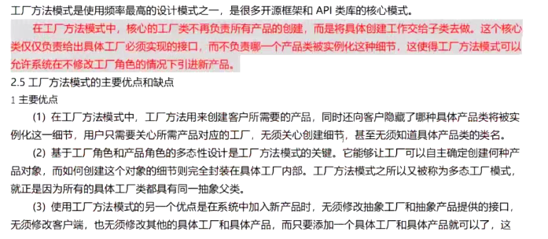
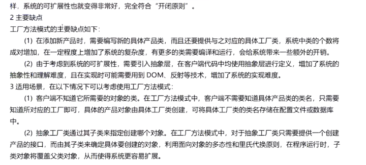

### 工厂方法模式















```c++
#include <iostream>
#include <string>
#include <queue>

using namespace  std;

struct Logger
{
	virtual void writeLog() = 0;
	virtual ~Logger() {}
};

class FileLogger :public Logger{
public:
	FileLogger() {  }
	~FileLogger() {  }

	void writeLog()
	{
		cout << "FileLogger: writeLogger" << endl;
	}
};

class DatabaseLogger :public Logger {
public:
	DatabaseLogger(){}
	~DatabaseLogger() {}

	void writeLog()
	{
		cout << "DataLogger: writeLogeer" << endl;
	}
};

struct LoggerFactory {
	//virtual Logger* createLogger() = 0;
	virtual unique_ptr<Logger> createLogger() = 0;
	virtual ~LoggerFactory(){}
};

class FileFactory :public LoggerFactory {
public:
	FileFactory(){}
	~FileFactory(){}

	unique_ptr<Logger>  createLogger()
	{
		return unique_ptr<Logger> (new FileLogger());
		//return new FileLogger();
	}
};

class DatebaseFactory :public LoggerFactory {
public:
	DatebaseFactory() {  }
	~DatebaseFactory() {  }

	unique_ptr<Logger> createLogger()
	{
		return unique_ptr<Logger>(new DatabaseLogger());
		//return new DatabaseLogger();
	}
};

int main()
{
	unique_ptr<LoggerFactory> upf(new FileFactory());
	unique_ptr<LoggerFactory> upd(new DatebaseFactory());
	unique_ptr<Logger> plog(nullptr);

	//plog.reset(upf->createLogger());
	plog = upf->createLogger();
	plog->writeLog();
	

	//plog.reset(upd->createLogger());
	plog = upd->createLogger();
	plog->writeLog();
	return 0;
}
```

