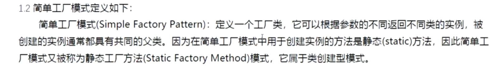

### 简单工厂模式





```c++
#include <iostream>
#include <string>
#include <memory>
using namespace std;
/*
* 使用protected 构造函数和友元类的意义
* 在Shape类中使用 虚的析构函数的意义；
* 改用智能指针可以提高灵活性
*/

struct Shape
{
	virtual void draw() const= 0;
	virtual void erase() const= 0;
	virtual void count() const= 0;
	virtual void setValue(const float val) = 0;
	static Shape* factory(const string& type);
	/*************重中之重*********************/
	virtual ~Shape() {};
};


class Circle :public Shape {
	friend class Shape;		
private:
	float redius;
	static const float PI;
protected:
	Circle(float _redius = 0) :redius(_redius) { cout << "construct Circle" << endl; }
public:
	~Circle(){ cout << "destory construct Circle" << endl; }
	void draw() const{ cout << "construct redius "<<this->redius<<" cm Cricle" << endl; }
	void erase() const{ cout << "erase redius " << this->redius<< " cm Cricle" << endl; }
	void count() const{ cout << "area = " << PI * this->redius * this->redius << endl; }
	void setValue(const float val) {
		this->redius = val;
	}
};
const float Circle::PI = 3.14;

class Square :public Shape {
	friend class Shape;
private:
	float length;
protected:
	Square(float _length = 0) :length(_length) { cout << "construct Square" << endl; }
public:
	~Square() { cout << "destory constuct Square" << endl; }
	void draw() const{ cout << "draw lenght " <<this->length<<"Square"<< endl; }
	void erase() const{ cout << "erase lenght " << this->length << "Square" << endl; }
	void count() const{ cout << "area = " <<this->length*this->length << endl; }
	void setValue(const float val) {
		this->length = val;
	}
};


Shape* Shape::factory(const string& type) {
	if (type == "Circle")
	{
		return new Circle();
	}
	else if (type == "Square") {
		return new Square();
	}
	else {
		return nullptr;
	}
}

//struct ShapeFactory {
//	Shape* GetShape(const string& type) {
//		return Shape::factory(type);
//	}
// };

class ShapeFactory {

public:
	shared_ptr<Shape> GetShape(const string& type) {
		return shared_ptr<Shape>(Shape::factory(type));
	}
 };
int main()
{
	unique_ptr<ShapeFactory> ups(new ShapeFactory());
	shared_ptr<Shape> p = ups->GetShape("Circle");
	if (p) 
	{
		p->setValue(10.0);
		p->draw();
		p->count();
	}
	
	p = ups->GetShape("Square");
	if (p) 
	{
		p->setValue(10.0);
		p->draw();
		p->count();
	}
	/*ShapeFactory* shapeF = new ShapeFactory();
	Shape* c = shapeF->GetShape("Circle");
	c->setValue(10.0);
	c->draw();
	c->count();
	delete c;*/
}
```


```c++
#include <iostream>
#include <string>
#include <memory>
#include <unordered_map>
/*
	shared_ptr 使用的意思
	unodered_map d使用 
*/
using namespace std;
 
class NotPayment {
public:
	NotPayment(const string& payName) { cout << "NotPayment :" << payName << endl; }
};

struct Payment {
	virtual void Pay(const float) = 0;
	static Payment* Factory(const string&);
	virtual ~Payment(){}
};

class DebitCard : public Payment {
	friend class Payment;
protected:
	DebitCard() { cout << "Create DebitCard" << endl; }
public:
	~DebitCard() { cout << "Destory DibitCard" << endl; }
	void Pay(const float ft) { cout << "DebitCard pay " << ft << "$" << endl; }

};

class WeChat : public Payment {
	friend class Payment;
protected:
	WeChat() { cout << "Create WeChat" << endl; }
public:
	~WeChat() { cout << "Destory WeChat" << endl; }
	void Pay(const float ft) { cout << "WeChat pay " << ft << "$" << endl; }

};
Payment* Payment::Factory(const string& payName)
{
	if ("DebitCard" == payName)
	{
		return new DebitCard();
	}
	else if ("WeChat" == payName) 
	{
		return new  WeChat();
	}
	else 
	{
		//return nullptr;
		throw NotPayment(payName);
	}
}

class PayFactory {
private:
	unordered_map<string, shared_ptr<Payment>> mp;
public:
	PayFactory() 
	{
		string payNames[] = { "DebitCard","WeChat" };
		for (auto& x : payNames)
		{
			mp.insert(std::pair<string, shared_ptr<Payment>>(x,shared_ptr<Payment>(Payment::Factory(x))));
		} 
	}
	shared_ptr<Payment> GetPayObject(const string& payName) 
	{
		try {
			return mp.at(payName);
		}
		catch (...)
		{
			return nullptr;
		}
	}
};

int main()
{
	unique_ptr<PayFactory> upt(new PayFactory());
	shared_ptr<Payment> spt = upt->GetPayObject("WeChat");
	spt->Pay(5);
	spt = upt->GetPayObject("DebitCard");
	spt->Pay(5);
	spt = upt->GetPayObject("DebitCrd");
	if (spt) {
		spt->Pay(5);
	}
	spt = upt->GetPayObject("DebitCard");
	spt->Pay(6);
	return 0;
}

```

