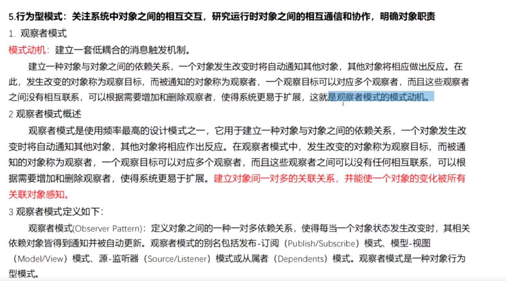

### 观察者模式




```C++
#include <iostream>
#include <string>
#include <queue>
#include <thread>
#include <list>
#include <mutex>
using namespace  std;
/*
* 观察者模式
* 
*/

class Subject;

class Observer 
{
protected:
	string name;
	Subject* sub;
public:
	Observer(string _name,Subject* s):name(_name),sub(s){}
	virtual ~Observer(){}
public:
	virtual void update() = 0;
};

class StockObserver :public Observer 
{
public:
	StockObserver(string _name,Subject* s):Observer(_name,s){}
	void update();

};
class NBAObserver :public Observer
{
public:
	NBAObserver(string _name, Subject* s) :Observer(_name, s) {}
	void update();
};


//通知者
class Subject {
protected:
	list<Observer*> observers;
public:
	string event;
	virtual void attach(Observer*) = 0;
	virtual void detach(Observer*) = 0;
	virtual void notify() = 0;
};

class Secretary :public Subject {
public:
	void attach(Observer* obs)
	{
		observers.push_back(obs);
	}
	void detach(Observer* obs)
	{
		observers.remove(obs);
	}
	void notify()
	{
		for (auto& x : observers)
		{
			x->update();
		}
	}
};
void StockObserver::update()
{
	cout << name << "收到消息:" << sub->event << endl;

	if (sub->event == "Boss来了")
	{
		cout << "马上关闭炒股软件，装作认真工作的样子" << endl;
	}
	if (sub->event == "吃饭时间到")
	{
		cout << "干饭 干饭" << endl;
	}
}

void NBAObserver::update()
{
	cout << name << "收到消息:" << sub->event << endl;

	if (sub->event == "Boss来了")
	{
		cout << "马上关闭NBA，装作认真工作的样子" << endl;
	}
	if (sub->event == "吃饭时间到")
	{
		cout << "干饭 干饭" << endl;
	}
}

int main()
{
	Subject *se = new Secretary();
	Observer* p1 = new StockObserver("小张",se);
	Observer* p2 = new NBAObserver("小王", se);

	se->attach(p1);
	se->attach(p2);

	se->event = "吃饭时间到";
	se->notify();

	se->event = "Boss来了";
	se->notify();
	return 0;
}
```

