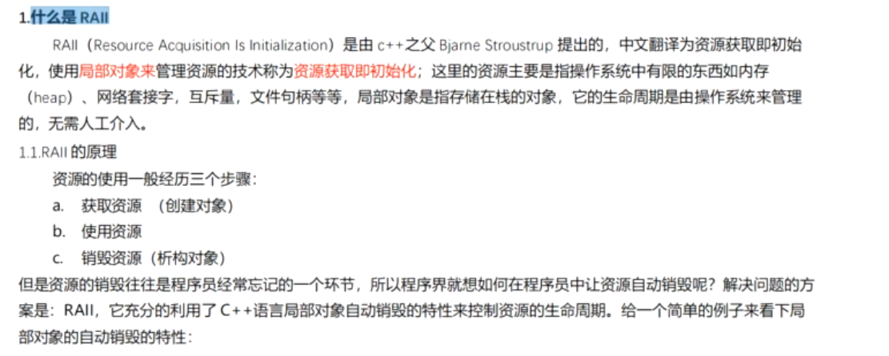

```c++

/*
* auto_ptr 智能指针
* 归属权 不明确
* 拷贝函数 赋值函数无法编写
* auto_ptr不能指向数组
* auto_ptr不能共享所有权
* auto_ptr不能通过复制操作来初始化
* auto_ptr不能放入容器中使用
* auto_ptr不能作为容器的成员
*/

namespace peter 
{
template <class _Ty>
class auto_ptr
{
private:
	bool _Owns;
	_Ty* _Ptr;
public:
	typedef _Ty element_type;
public:
	auto_ptr(_Ty* p = nullptr):_Ptr(p),_Owns(p != nullptr){}
	~auto_ptr()
	{
		if (_Owns)
		{
			delete _Ptr;
		}
		_Ptr = nullptr;
		_Owns = false;
	}
public:
	_Ty* get() { return _Ptr; }
	_Ty& operator*() { return *get(); }
	const _Ty& operator*()const { return *get(); }
	_Ty* operator->(){return get(); }
	const _Ty* operator->() const { return get(); } 
	void reset(_Ty* ptr = nullptr)
	{
		if (ptr == this) { return; }
		if (_Owns)
		{
			delete _Ptr;
		}
		_Ptr = ptr;
		_Owns = (ptr != nullptr);
	} 
	_Ty* release()const
	{
		_Ty* ptr = nullptr;
		if (_Owns)
		{
			ptr = _Ptr;
			((auto_ptr<_Ty>*)this)->_Ptr = nullptr;
			((auto_ptr<_Ty>*)this)->_Owns = false;
		}
		return ptr;
	}
	void swap(auto_ptr& it)
	{
		std::swap(_Ptr, it._Ptr);
		std::swap(_Owns, it.Owns);
	}
};
}


/*
* template 模板类的使用 
* 模板类的特化版本
*/

template <class T = int>
class C{
private:
	T value;
public:
	void print(cout << "C T" << endl;)
};
template <class T>
class C<T*> {
private:
	T value;
public:
	void print(cout << "C T*" << endl;)
};
template <class T>
class C<const T*> {
private:
	T value;
public:
	void print(cout << "C T*" << endl;)
};


/*
* 输出结果 Object fun a 10
* 静态联编 可访问性 参数 运行前
* 动态联编 运行时 查询虚表
*/
class Base
{
public:
	~Base(){}
public:
	virtual void fun(int x = 10) { cout << "Base::Fun x " << x << endl; }
};

class Object :public Base
{
private: 
	virtual void fun(int a  = 200) {
		cout << "Object::fun a " << a << endl;
	}
};

int main()
{
	Object obj;
	Base* p = &obj;
	p->fun(5);
	return 0;
}


```

