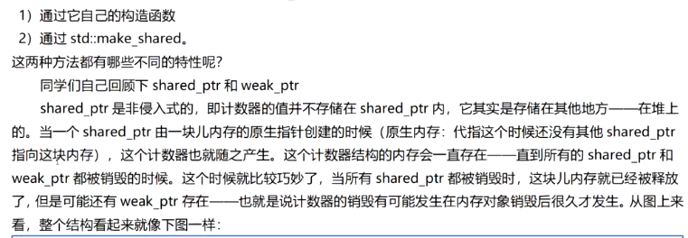
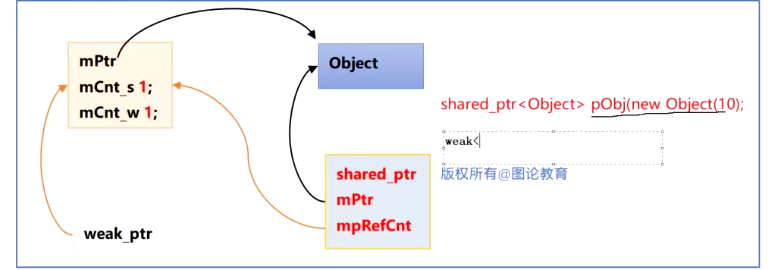
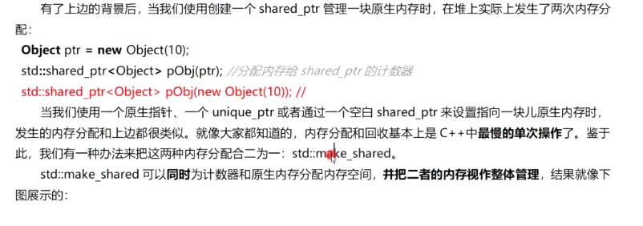
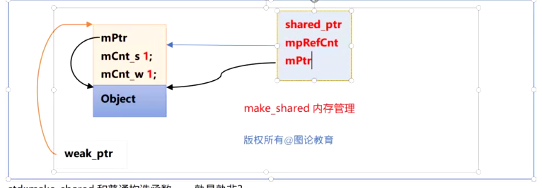
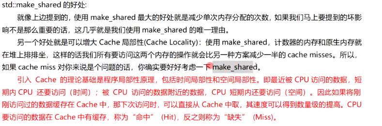
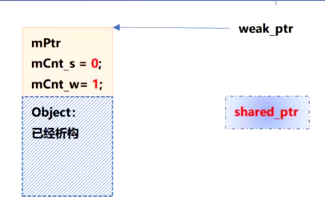
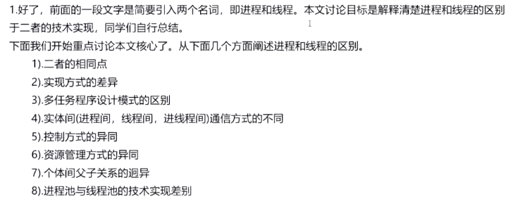

```c++
//查看下面程序可能出现的问题 
struct Object
{
	Object(int x):i(x){}
    int i;
};
void  doSomething(std::shared_ptr<Object>pt,double d)
{
   
}
//该函数可能抛出异常
double couldThrowException()
{
    //throw 10;
    return 12.23;
}
int main()
{
    doSomething(std::shared_ptr<Object>(new Object(1024)),couldThrowException());
	return 0;    
}
//内存泄漏，构造顺序 
// 1. new Object(1024) 在堆上申请空间构造Object
// 2. 执行couldThrowException() 发生异常 调用结束
// 3. 构建shared_ptr  但是上一步发生异常 调用doSomething 已经结束 不在会执行第三步构建 导致内存泄漏

doSomething(std::make_shared<Object>(10),couldThrowException());
//这样就不会产生内存泄漏
```






