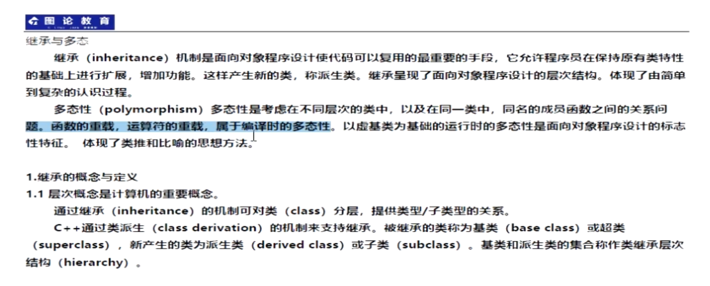
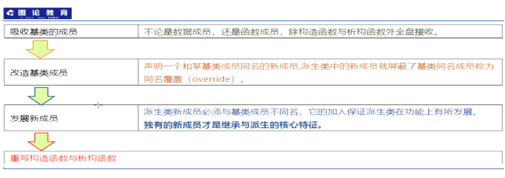
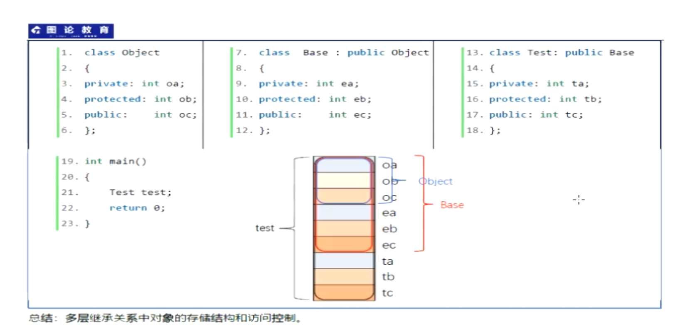
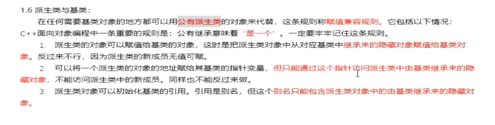
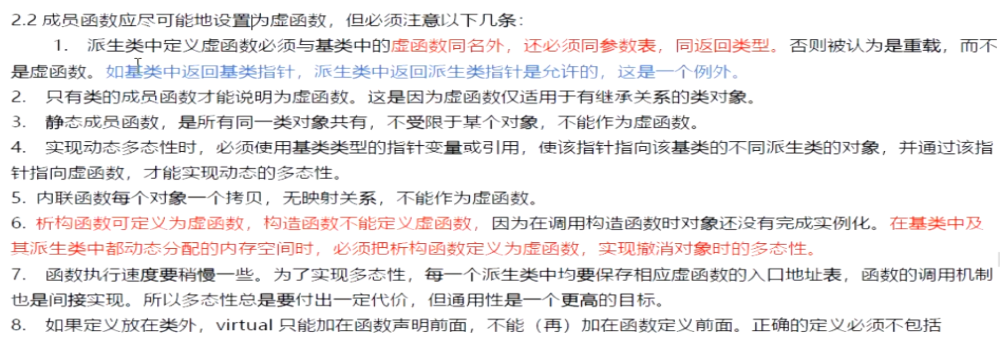

### Inheritance





```c++
// 继承
//总结：
//	派生类的成员方法可以访问基类的protected 和 public 属性
//  公有继承 体现 是一个  例子 ：学生是一个人
//	私有继承 体现 由什么来组成 ：汽车由发动机来组成  可以用成员对象替代他

//私有继承 

class Base {
private: int ba;
protected:int bb;
public: int bc;
};

class Object :private Base {
private: int oa;  
	   //Base base;
protected:int ob;
public:int oc;
	  void fun()
	  {
		  oa = ob = oc = 0;
		  //  ba = 0;
		  bb = 0;
		  bc = 0;
	  }
};

int main()
{
	Object object;
	object.fun();
	//object.bc = 10;
	object.oc = 20;
	return 0;
}


//保护继承
class Base {
private: int ba;
protected:int bb;
public: int bc;
};

class Object :protected Base {
private: int oa;
protected:int ob;
public:int oc;
	  void fun()
	  {
		  oa = ob = oc = 0;
		  //  ba = 0;
		  bb = 0;
		  bc = 0;
	  }
};

int main()
{
	Object object;
	object.fun();
	//object.bc = 10;
	object.oc = 20;
	return 0;
}


//公有继承

class Base {
private: int ba;
protected:int bb;
public: int bc;
};

class Object :public Base {
private: int oa;
protected:int ob;
public:int oc;
	  void fun()
	  {
		  oa = ob = oc = 0;
		//  ba = 0;
		  bb = 0;
		  bc = 0;
	  }
};

int main()
{
	Object object;
	object.fun();
	object.bc = 10;
	object.oc = 20;
	return 0;
}

```



### 多态



```c++

class Person {
private:
	string name;
	string id;
public:
	Person(string _name,string _id):name(_name),id(_id){}
	~Person(){}
};

class Student:public Person {
private:
	int snode;
public:
	Student(string _name,string _id,int _snode):Person(_name,_id),snode(_snode){}
	~Student(){}
	void print() {
		cout <<  snode << endl;
	}
};

int main()
{
	Person p("zhang", "61042333");
	Student s("wang", "610429222", 19060);

	p = s;

	//Student* sp = (Student*)&p;
	//sp->print();
	//这种行为，如果访问的是 内置类型 则会打印随机值
	// 如果是string 则会崩溃，访问失败。
	return 0;
}
```

继承中的拷贝构造

```c++

//	继承中的拷贝构造
//	如果拷贝构造不需要申请新的资源 建议使用缺省的拷贝构造
//	如果需要申请新的资源，我们需要完成派生类和基类的拷贝构造，
//	并且在派生中明确指出构建时调用基类的那个构造函数

class Person {
private:
	string name;
	string id;
public:
	Person(){}
	Person(string _name,string _id):name(_name),id(_id){}
	Person(const Person& _person):name(_person.name),id(_person.id){}
	~Person(){}
};

class Student:public Person {
private:
	int snode;
public:
	Student(string _name,string _id,int _snode):Person(_name,_id),snode(_snode){}
	Student(const Student& _student):snode(_student.snode),Person(_student){}
	~Student(){}
	void print() {
		cout <<  snode << endl;
	}
};

int main()
{
	Student s("wang", "610429222", 19060);
	Student stu(s);
	return 0;
}
```

operator= 复制语句也有上述情况 但是与其还有不同的表现形式

成员对象 和 继承中 拷贝构造 和 赋值构造 区别 写博客 私有




继承关系中： 不同类之间 同名（无须同参数，同返回值）隐藏  同类中 重载  

默认就近原则

```c++

class Base {
public:
	int value;
public:
	void func(int x,int y,int z)
	{
		cout << "Base func " << value << endl;
		value = x;
	}
};

class Object :public Base {
public:
	int value;
	int num;
public:
	void func(int x)
	{
		cout << "Object func" << " " << value << " " << num << endl;
		value = num = x;
	}
	void  func(int x, int y)
	{
		value = x;
		num = y;
		cout << "Object" << value <<" " << num << endl;
	}
};


int main()
{
	Object b1;
	b1.func(1);
	b1.func(2, 3);
	b1.Base::func(1, 2, 3);

	
```

virtual

静态函数不能声明为虚函数

友元函数不能声明为虚函数

c++构造函数也不能定义为虚函数

内联函数不能声明为虚函数

内联函数在编译时，将其展开，多态virtual调用之时才进行构建的。

这些函数均有一个共同的特点没有this 指针

因为构造函数负责置虚表指针，在没有构建虚表之前，构建虚表明显的不行

虚构函数可以为虚函数，因为它在重置虚表指针

```c++
/*
* 描述虚表的构建过程
* 在构建过程中拷贝父对象的虚表，是为了防止虚表中的次序发生变化，导致查表复杂
*/
class Base {
private:
	int value;
public:
	Base(int x = 0):value(x){}
	virtual ~Base(){}
public:
	virtual void add() { cout << "Base add" << endl; }
	virtual void fun() { cout << "Base fun" << endl; }
	virtual void print() { cout << "Base print" << endl; }

};

class Object :public Base {
private:
	int num;
public:
	Object(int x =0):Base(x),num(x+10){}
	virtual ~Object(){}
public:
	virtual void add() { cout << "Object add" << endl; }
	virtual void fun() { cout << "Object fun" << endl; }
	virtual void show() { cout << "Object show" << endl; }
};

class Test :public Object {
private:
	int count;
public:
	Test(int x = 0) :Object(x), count(x + 10) {}
	virtual ~Test() {}
public:
	virtual void add() { cout << "Test add" << endl; }
	virtual void print() { cout << "Test print" << endl; }
	virtual void show() { cout << "Test show" << endl; }
}
};
int main()
{
	Test test(10);
	test.add();
	test.fun();
	test.print();
	test.show();
	return 0;
}

```

```c++
/*
* 输出结果 Object fun a 10
* 静态联编 可访问性 参数 运行前
* 动态联编 运行时 查询虚表
*/
class Base
{
public:
	~Base(){}
public:
	virtual void fun(int x = 10) { cout << "Base::Fun x " << x << endl; }
};

class Object :public Base
{
private: 
	virtual void fun(int a  = 200) {
		cout << "Object::fun a " << a << endl;
	}
};

int main()
{
	Object obj;
	Base* p = &obj;
	p->fun(5);
	return 0;
}

```

