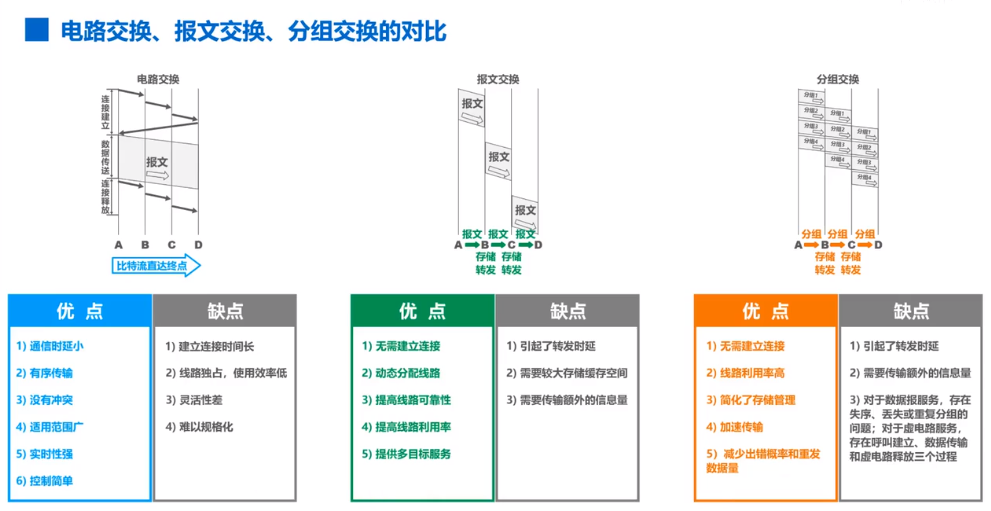
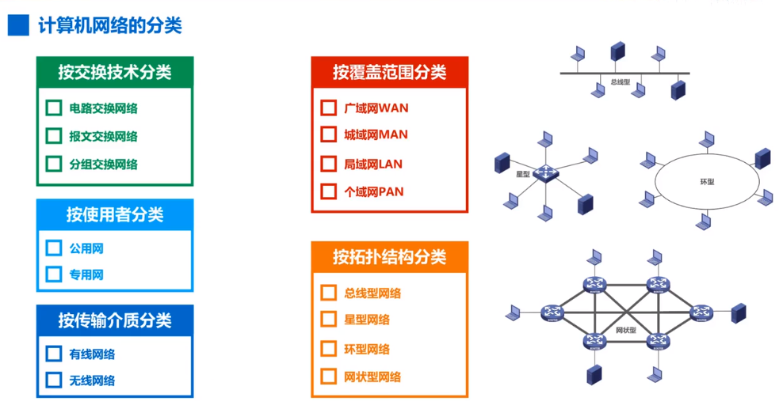
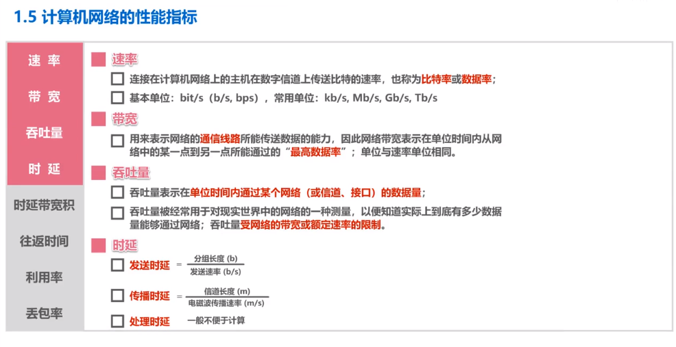
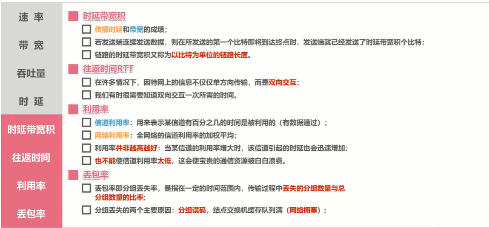
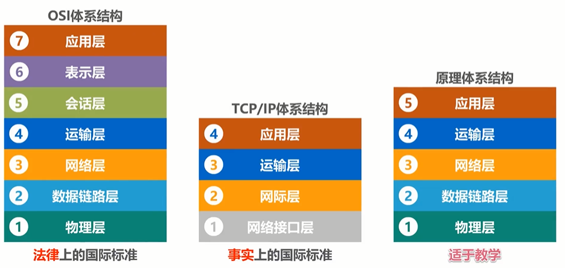
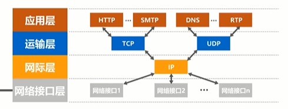
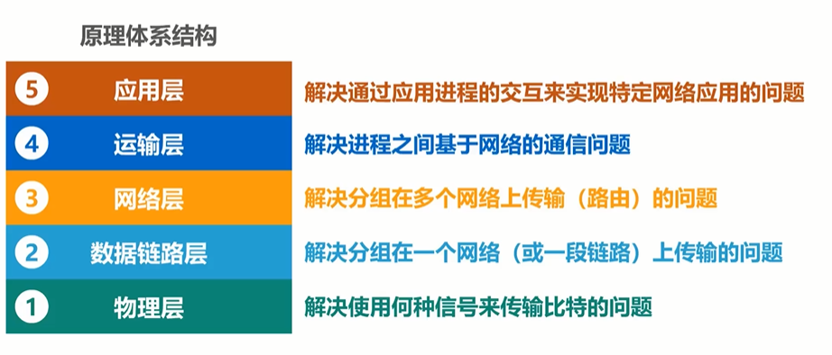
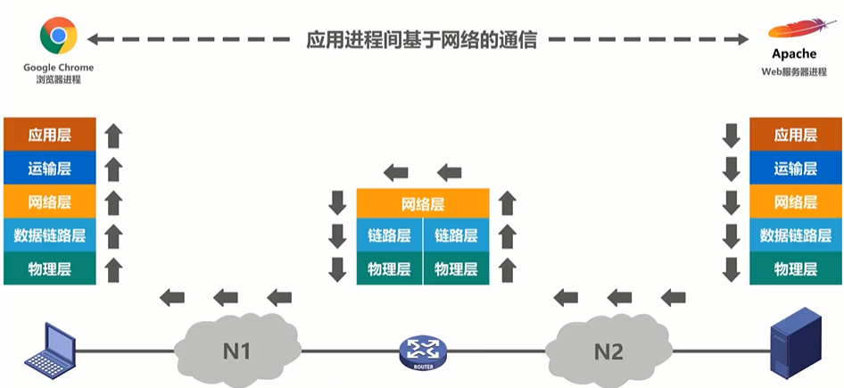
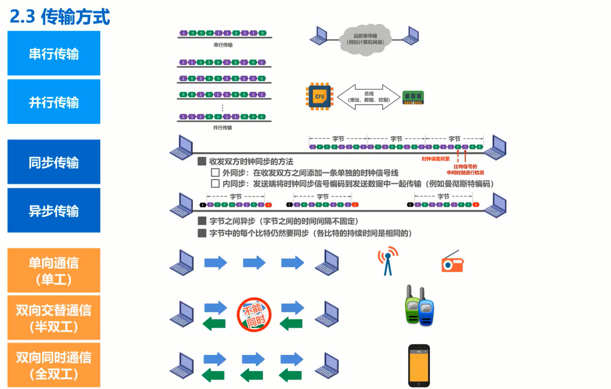
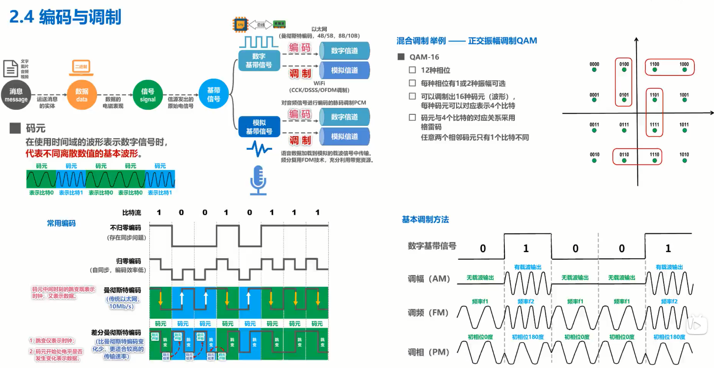

### 计算机网络

##### 概念

网络（Network) 由若干结点(Node)和连接这些结点的链路(Link)组成。

多个网络还可以通过路由器连接起来，这样就构成了一个覆盖范围更大的网络，即互联网

因特网(Internet)是世界上最大的互联网络(用户数以亿计，互连的网络数以百万计)。

internet (互联网): 他泛指由多个计算机网络互连而成的网络。在这些网络之间的通信协议可以是任意的。

Internet(因特网)则是一个专有名词，它指当前全球最大的、开放的、由众多网络互连而成的特定计算机网络，它采用TCP/IP协议族作为通信的规则，其前身是美国的ARPANET

##### 因特网的组成

###### 边缘部分

由所有连接在因特网上的主机组成。这部分是用户直接使用的，用来进行通信（传输数据、视频或音频）和资源共享。

###### 核心部分

由大量网络和连接这些网络的路由器组成。这部分是为边缘部分提供服务的(提供连通性和交换)。

   

计算机网络的简单定义：

​	一些互相连接的、自治的计算机的集合。

​	互连  是指计算机之间可以通过有线或无线的方式进行数据通信

​	自治 是指独立的计算机，它有自己的硬件和软件，可以单独运行使用。

​	集合 是指至少需要两台计算计

计算机网络的较好的定义：

​	计算机网络主要是由一些通用的、可编程的硬件互连而成的，而这些硬件并非专门用来实现某一特定目的（例如，传送数据或视频信号）。这些可编程的硬件能够用来传送多种不同的类型，并能支持广泛的和日益增长的应用。

##### 计算机网络体系结构

OSI 标准失败的原因：

1.OSI的专家们缺乏实际经验，没有商业驱动力

2.OSI的协议实现起来过分复杂，而且运行效率低。

3.OSI标准的制定周期太长，使得按OSI标准生产的设备无法及时的进入市场 

4.OSI的层次划分不合理，有些功能重复出现。

##### 计算机网络体系结构分层的必要性

 

应用层 生成 http 报文

 运输层 http报文加tcp  使之成为tcp报文段  其作用只要是为了区分应用进程以及实现可靠的传输

网络层 给tcp报文加ip首部 使之成为ip数据报 使其可以在网上传输，可以被路由器转发

数据链路层 给Ip数据报加上 加一个首部和一个尾部 使之成为帧 以以太网为例 帧头部信息 使其能够在一段哦链路上传输或一个网络上传输，能够被相应的目的主机接收，尾部信息为了让主机检查所接受到帧是否有误码

物理层 会为帧加上一个前导码，为了让目的主机做好接收帧准备，将其变成相应的信号发到传输媒体

